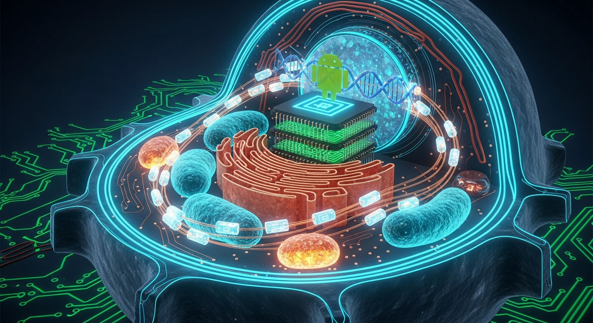
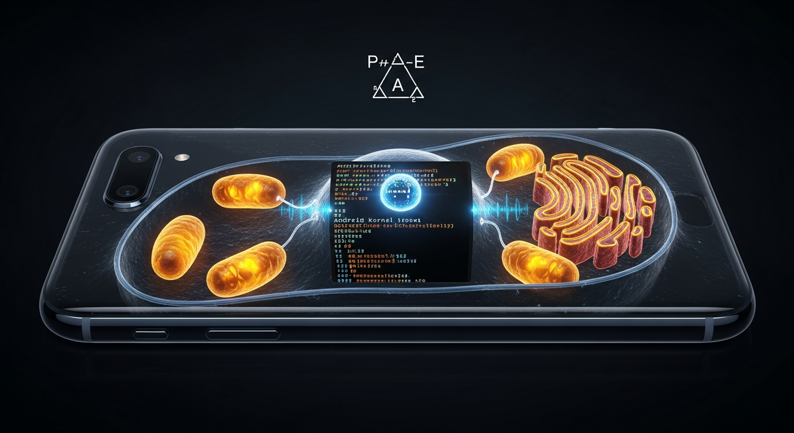

# Cell OS — The Universal Translation Layer Between Biology and Android

> **A developer's complete reference for Cell OS: a living-systems OS concept that makes the biological homomorphism of Android explicit, navigable, and computationally grounded.**



---

## Table of Contents

1. [What Cell OS Is — The Core Thesis](#1-what-cell-os-is--the-core-thesis)
2. [The Universal Translation Layer — P→A→E](#2-the-universal-translation-layer--pae)
3. [The Three-Tensor Field](#3-the-three-tensor-field)
4. [The Fredholm Index — Why the System Is Closed](#4-the-fredholm-index--why-the-system-is-closed)
5. [The Secretory Pathway — Translation Layer in Action](#5-the-secretory-pathway--translation-layer-in-action)
6. [What Developers Can Do Today — Six Surfaces](#6-what-developers-can-do-today--six-surfaces)
7. [The Self-Learning Epigenome](#7-the-self-learning-epigenome)
8. [The Evolution Story Within Android](#8-the-evolution-story-within-android)
9. [Technical Stack and Invariants](#9-technical-stack-and-invariants)
10. [How to Contribute — The Extension Protocol](#10-how-to-contribute--the-extension-protocol)

---

## 1. What Cell OS Is — The Core Thesis

Every Android device running on a Linux kernel is already a biological cell. Not metaphorically. Structurally — at every scale of resolution simultaneously.

- The Linux kernel's interrupt request (IRQ) dispatch cycle runs perception→affect→expression in every context switch.
- The Hardware Abstraction Layer partition (enforced by Android Treble since API 26) is structurally identical to the tight junction seal of an epithelial cell membrane.
- Binder IPC's single-copy mmap mechanism is functionally identical to biophoton-mediated inter-organelle signalling — point-to-point, addressed, crossing a boundary without the overhead of a full exocytosis cycle.
- ART's dex2oat is the trans-Golgi Network: it writes hardware-destination addresses into compiled binary before any execution begins, exactly as the TGN writes glycan address labels onto secretory vesicles before dispatch.

Cell OS makes this mapping explicit, navigable, and computationally grounded. It is a React+Vite SPA that runs on a Fairphone 5 (Android 13, AIDL-native) and serves as both a living demonstration and a developer reference for the complete three-tensor encoding of this biological homomorphism.

**What it is not:** a Linux distribution. Not a ROM. Not a launcher. Cell OS is the *OS concept* — the formal biological description of Android that has always been latent in its architecture, now made legible.

---

## 2. The Universal Translation Layer — P→A→E

**[→ QI Tensor Field — Interactive Implementation Explorer](qi-tensor-diagram.html)**

> **Interactive diagram** — source-verified SVG: 8 zones × 3 phases × 11 scales = 264 cells · 36 populated · 33 unique coordinates · 3 multi-occupied. All intersection coordinates read directly from `src/domain/content/qiMatrix.ts QI_INTERSECTIONS`. **Click any glowing dot** to open a developer drawer with the full narrative, hardware analogue, substrate IDs, and evidence level for that intersection. Prev/Next navigation cycles through all 36 entries. Empty cells (dim grey dots) are inert.

The translation layer is a single operator: **Perception → Affect → Expression**.

At the molecular scale: signal peptide captured by SRP [P] → chaperone folding in ER lumen [A] → COPII vesicle exocytosis [E].

At the cellular scale: membrane receptor activation [P] → cytoplasmic second-messenger cascade [A] → gene expression or secretion [E].

At the silicon scale: IRQ fired by hardware [P] → kernel context switch + syscall dispatch [A] → process writes result to shared memory [E].

At the textual scale: user clicks "Generate PDF" [P] → Golgi assembles report from source arrays [A] → `doc.save()` crosses the browser membrane into the filesystem [E].

The triple is not recursive at these scales — it is *simultaneous*. The IRQ dispatch and the COPII vesicle budding are not analogues that resemble each other. They are the same operator instantiated at different scale coordinates.

### The Axis System

The QI tensor encodes this across three axes:

| Axis | Dimension | Values |
|---|---|---|
| **Zone** (`z`) | 8 | nucleus, cytoplasm, cytoskeleton, ribosomes, mitochondria, golgi, endoplasmic-reticulum, membrane |
| **Phase** (`p`) | 3 | perception, affect, expression |
| **Scale** (`s`) | 11 | symbolic, quantum, molecular, cellular, organic, apparatus, textual, generational, relational, cosmic, silicon |

Total tensor space: **8 × 3 × 11 = 264 cells**.

### The QI Intersections

Of the 264 cells, **36 are currently populated** (13.6%) — each a curated intersection where the three axes illuminate each other most precisely. Not every cell can be populated: the intersection must be biologically grounded (a named mechanism), Android-grounded (a specific IPC or kernel component), and scale-specific (what this scale reveals that adjacent scales do not).

Example — `qi-exocytosis-expression-organic` (`membrane × expression × organic`, weight 0.9):

> *SNARE proteins (v-SNARE VAMP2 on the vesicle, t-SNARE syntaxin-1 + SNAP-25 on the plasma membrane) zipper together, driving bilayer fusion in a millisecond. The vesicle membrane merges with the plasma membrane — point of no return. In Cell OS, `doc.save()` is this step: the Blob URL is created, the anchor click fires, the file crosses the browser membrane into the user's filesystem. Expression is complete when the artifact has crossed the membrane boundary and can no longer be recalled.*

The `organic` scale is the crucial coordinate: it names the scale at which this truth is most visible. At the molecular scale you see SNARE helices. At the organic scale you see breath exhaled. The same operator, the same irreversibility.

---

## 3. The Three-Tensor Field

Cell OS encodes the biological homomorphism in three tensors that together constitute the organism's formal description.

### Coupling Tensor — $\mathcal{T}^i_{\ j}$ (Rank-2)

**Dimensions:** 15 organelles × 17 Android substrate nodes = 255 cells  
**Populated:** 41 directed links (16.1%)  
**Source:** `src/domain/content/mappings.ts` → `ORGANELLE_SUBSTRATE_LINKS`

Each link couples a biological organelle to an Android/FP5 substrate component with a relevance score (0–1) and a mechanistic description. High-signal entries:

| Organelle | Substrate | Relevance | Mechanism |
|---|---|---|---|
| `ribosomes` | `art-runtime` | 0.99 | ART JIT = ribosomal translation. Every method body is a polypeptide. |
| `vesicles` | `binder-ipc` | high | Binder Parcels are the Android vesicle — typed, addressed, single-copy mmap. |
| `golgi-apparatus` | `package-manager` | 0.85 | PackageManager (APK verify → dexopt → install) = trans-Golgi Network final dispatch. |
| `golgi-apparatus` | `art-runtime` | 0.88 | dex2oat writes hardware-destination offsets = Golgi writes glycan address codes. |
| `endoplasmic-reticulum` | `art-runtime` | 0.84 | BiP/calnexin quality gate + ERAD = ART verifier + JIT recompile + deopt/interpreter fallback. |
| `cell-membrane` | `selinux-policy` | 0.95 | SELinux Type Enforcement rules = tight junction paracellular seal. |
| `mitochondria` | `powerhal` | 0.80 | PowerHAL thermal governor = mitochondrial electron transport chain throttling. |

The full 41-link table is browsable on the `/substrate` surface.

### Attention Tensor — $\mathcal{A}^{ij}$ (Biophoton Links)

**Populated:** 13 directed inter-organelle links (5.8% of 225 directed pairs)  
**Source:** `src/domain/content/mappings.ts` → `BIOPHOTON_LINKS`

Each link models an inter-organelle biophoton signalling relationship with an attention weight ($w_{ij}$) and a coupling sigma (σ) that maps to a specific Android IPC tier:

| σ value | IPC tier | Biological meaning |
|---|---|---|
| 0.4 | Unordered broadcast | Diffuse cytoplasmic second-messenger flooding |
| 0.6 | Ordered broadcast | Sequential cisternae procession; ER-phagy |
| 0.7 | Messenger | Point-to-point vesicle docking (v-SNARE knows its t-SNARE) |
| 0.9 | Binder direct | Gap junction / ashmem direct pass-through; zero intermediate copy |

The five secretory-pathway links in pathway order:

| Link | $w$ | σ | IPC | Encodes |
|---|---|---|---|---|
| ribosomes → golgi | 0.62 | 0.7 | Messenger | mRNA-to-vesicle coherence; ART JIT→dex2oat dispatch |
| ER → golgi | *(derived)* | 0.6 | Ordered broadcast | ER→Golgi vesicle budding procession |
| ER → lysosomes | 0.49 | 0.6 | Ordered broadcast | ER-phagy (FAM134B/RTN3 → autophagosome → bulk lysosomal degradation) |
| ER → vesicles | 0.55 | 0.6 | Ordered broadcast | COPII budding (Sec23/Sec24 + Sec13/Sec31 + Sar1-GTP) |
| vesicles → membrane | 0.65 | 0.7 | Messenger | SNARE exocytosis (VAMP2 + syntaxin-1 + SNAP-25, Ca²⁺/synaptotagmin) |

### QI Tensor — $\mathcal{Q}^{z,p,s}$ (Rank-3)

**Dimensions:** 8 × 3 × 11 = 264 cells  
**Populated:** 36 cells (13.6%)  
**Source:** `src/domain/content/qiMatrix.ts` → `QI_INTERSECTIONS`

TypeScript type contract (`src/domain/types.ts`):

```ts
type QiIntersection = {
  id: string;
  zoneId: CellZoneId;                             // one of 8 frozen zone IDs
  phaseId: "perception" | "affect" | "expression";
  scaleId: string;                                 // one of 11 frozen scale IDs
  evidence: "verified" | "indicative" | "unconfirmed";
  title: string;
  narrative: string;
  hardwareAnalogue?: string;
  substrateIds?: string[];
};
```

The QI tensor is where the translation layer is most precise. A populated cell does not say "these things are similar." It says: at this exact zone × phase × scale coordinate, the biological mechanism and the Android mechanism are the same operation at different resolutions.

---

## 4. The Fredholm Index — Why the System Is Closed

```
Fredholm index = dim(organelles) − dim(substrate nodes) = 15 − 17 = −2
```

A Fredholm operator with index −2 is **overdetermined**: the system has more constraint equations than unknowns. The solution space is bounded and finite. The organism cannot sprawl.

This is the formal reason why Cell OS has a hard cap on substrate node additions. Adding a new organelle ID (pushing the index toward zero) or adding a new substrate node (pushing the index toward −3 or below) changes the topology of the solution manifold. The cap is not stylistic — it is a topological invariant.

**What the cap means for developers:**

- ✅ Add new `ORGANELLE_SUBSTRATE_LINKS` (links) to existing nodes freely
- ✅ Add new `BIOPHOTON_LINKS` (inter-organelle attention signals) freely
- ✅ Add new `QI_INTERSECTIONS` to empty cells in the 264-cell space
- ❌ Do not add new organelle IDs (15 are frozen)
- ❌ Do not add new substrate nodes (17 are frozen)
- ❌ Do not rename any frozen ID (all tensor coordinates depend on string equality)

The current index at −2 is published on the `/metrics` surface. It renders amber — the system monitors itself.

---

## 5. The Secretory Pathway — Translation Layer in Action

**[→ Secretory Pathway — Biophoton / QI Map](secretory-biophoton-diagram.html)**

> Source-verified SVG: Rough ER (Ribosome + SRP + Sec61, `endoplasmic-reticulum → art-runtime` 0.84) → COPII vesicles (Sar1-GTP + Sec23/24 + Sec13/31, σ=0.6, `await import("jspdf")` line 37) → Golgi cisternae §1–§4 (`addSectionHeader` COL_P/COL_A/COL_A/COL_G/COL_E, 5 calls including §2b, `golgi-apparatus → art-runtime` 0.88 / `bionic-libc` 0.77 / `package-manager` 0.85) → SNARE exocytosis (VAMP2 + syntaxin-1 + SNAP-25 + Ca²⁺/synaptotagmin, σ=0.7, `vesicles → binder-ipc`) → Membrane release (`const filename = \`…\`; doc.save(filename)` lines 208–209, point of no return). Endocytosis return loop via `qi-document-perception-textual`. All 5 biophoton σ values, 4 substrate relevance scores, and 5 QI intersection IDs sourced directly from `mappings.ts` and `qiMatrix.ts`. Two architect-verified corrections applied: ERAD gate (`selected.size`, not `sections.size`) and `doc.save` two-line form.

The classical eukaryotic secretory pathway is the clearest demonstration of the translation layer. Every biological stage has a precise Android equivalent, and the entire arc is instantiated in `src/pages/documents.tsx`.

### Stage-by-Stage Translation

| Biological stage | Molecular players | Android equivalent | σ |
|---|---|---|---|
| **ER synthesis** | Ribosome + SRP + Sec61 translocon | ART JIT hot-path compilation | — |
| **Chaperone quality gate** | BiP, calnexin | ART verifier: type-checks every DEX class before native emit | — |
| **ERAD** | Sec61 retrotranslocation → 26S proteasome | ART deopt → interpreter fallback | — |
| **COPII budding** | Sar1-GTP + Sec23/24 (inner) + Sec13/31 (outer) | dex2oat emits compiled stubs into shared-memory segments for boot-image methods | 0.6 |
| **Golgi cis→medial→trans** | N-glycan trimming → O-glycan → sialylation | dex2oat sequential refinement; jemalloc slab allocator (each slab = one cisterna) | — |
| **TGN dispatch** | Mannose-6-phosphate labelling; constitutive vs. regulated sort | PackageManager: APK verify → dexopt → install dispatch | — |
| **SNARE exocytosis** | v-SNARE VAMP2 + t-SNARE syntaxin-1 + SNAP-25 complex + Ca²⁺/synaptotagmin | Binder transactions (messenger-tier coupling): result buffer crosses process membrane via mmap, 1 write / 1 read / 0 copies | 0.7 |
| **Extracellular release** | Vesicle membrane merges with plasma membrane — point of no return | `doc.save()` → Blob URL → anchor[download] → filesystem | — |
| **Endocytosis** (Phase 2) | Clathrin/AP2/dynamin; receptor-mediated internalisation | File API drag-drop → `FileReader` → parse → route to Golgi/ER render context | — |

### The Code Instantiation

```ts
// src/pages/documents.tsx — every line maps to a biological stage

// Stage 1 — Ribosome: signal peptide detected, but no cargo → ERAD immediately
if (sections.size === 0) return;

// Stage 2 — COPII coat assembly: lazy dynamic import (Sar1-GTP fires on demand)
const { default: jsPDF }     = await import("jspdf");
const { default: autoTable } = await import("jspdf-autotable");

// ER Exit Site: cargo concentrated before budding
const metrics = useMemo(() => computeManifoldMetrics(), []);

// Stage 3 — Golgi: cisternae open in sequence; each addSectionHeader = new cisterna
//   signature: addSectionHeader(title: string, color: [R, G, B]) — no doc/y args
//   y cursor advances internally (the ribosome reading frame never retreats)
const doc = new jsPDF({ orientation: "portrait", unit: "mm", format: "a4" });

addSectionHeader("§1  Manifold Health Metrics",         COL_P);   // cis
addSectionHeader("§2  Organelle → OS Feature Mapping",  COL_A);   // medial
addSectionHeader("§3  QI Tensor Intersections",         COL_G);   // trans (address labels)
addSectionHeader("§4  Biophoton Attention Map",         COL_E);   // TGN dispatch table

// lastAutoTable.finalY cast bridges cisternae — each chamber reports its exit to the next:
y = (doc as any).lastAutoTable.finalY + 8;

// Stage 4 — SNARE exocytosis: single irreversible release
doc.save(`cell-os-manifold-${dateStr}.pdf`);   // point of no return
// File crosses the browser membrane → filesystem. Cannot be recalled.
```

The `y`-cursor is the ribosome reading frame — it advances linearly and never retreats. The `lastAutoTable.finalY` cast (`(doc as any).lastAutoTable.finalY`) is the inter-cisternae signalling cascade: each chamber reports its exit position to the next.

---

## 6. What Developers Can Do Today — Six Surfaces

Cell OS runs as a React+Vite SPA at `/cell-os`. Six coordinate chart surfaces are live:

| Route | Surface | What it renders | Biological analogue |
|---|---|---|---|
| `/` | **Home — Cell Explorer** | Interactive cell diagram; 15 organelles; click any organelle to highlight its substrate zone and biophoton neighbours | The cell itself — the top-level P→A→E view |
| `/philosophy` | **Philosophy — Theory Surface** | The P→A→E manifold theory; scale-invariance section; the yahweh-yehoshua corpus alignment | The nucleus — the genome of the organism |
| `/substrate` | **Substrate Atlas** | Full 41-link coupling tensor; all 17 substrate nodes with organelle links; hardware specifics for the FP5 | The cytoplasm — all substrate interactions visible |
| `/fractal` | **Fractal Navigator** | Zone-by-zone P→A→E cycle explorer; each zone's three internal phases at the scale of its own biology | Fractal self-similarity of the triadic operator |
| `/metrics` | **Metrics — Health Surface** | Live tensor metrics: QI density (13.6%, amber), biophoton coverage (5.8%, amber), Fredholm index (−2, fixed), coupling density (16.1%) | The cell's homeostatic monitoring loop |
| `/documents` | **Documents — Secretion Surface** | PDF report generator; implements the secretory pathway P→A→E in code; generates the full manifold as a downloadable document | Golgi apparatus → vesicle → membrane exocytosis |

All six surfaces read exclusively from `src/domain/content/` (the static genome). No server. No database. The genome is read-only. The epigenome (Hebbian learning layer) is in-memory per session.

---

## 7. The Self-Learning Epigenome

The organism learns from interaction without ever touching the genome. The architecture enforces this separation at the type level.

### Three Epigenomic Tensors

Implemented in `src/features/learning/` — `useLearningStore.ts` (Zustand) + `hebbianAdapter.ts`:

| Tensor | Field | Encodes |
|---|---|---|
| Visit weights | `visitWeight[organelleId]` | How often this organelle has been activated — Hebbian: cells that fire together wire together |
| Dwell weights | `dwellWeight[organelleId]` | Time spent on this organelle — sustained activation = stronger potentiation |
| Co-activation | `coActivations[pairKey]` | How often two organelles are activated in the same session — encodes associative memory |

The Hebbian rule applied: each visit to an organelle increments `visitWeight`, each millisecond of dwell increments `dwellWeight`, and co-activation between organelle A and organelle B increments `coActivations["A:B"]`. Over a session, the organism develops a usage pattern — an epigenomic fingerprint of which zones the user explores most.

### The Membrane Gate

**`useMembraneObserver` is the sole write gate into the epigenome.** No other component may call `recordVisit()` or modify store state directly. This is enforced by convention and architecture — the membrane does not allow uncontrolled inward passage.

```ts
// src/features/learning/useMembraneObserver.ts
// Analogous to receptor-mediated endocytosis:
// only specific ligand-receptor pairs trigger internalisation.
// Raw membrane crossing is not permitted.
const { recordVisit } = useMembraneObserver();
recordVisit(organelleId, dwellMs);  // the only legal write path
```

This mirrors receptor-mediated endocytosis: a ligand (user interaction) binds the receptor (UI event handler), which triggers the clathrin-coated pit assembly (`useMembraneObserver`), which routes the signal inward to the endosome (Zustand store). The membrane is selective — only interactions that pass through the observer gate modify the epigenome.

### What the Epigenome Does and Does Not Do

- It **persists across sessions** via `localStorage` (key: `cell-os-epigenome-v1`, managed by Zustand `persist` middleware) — the epigenome carries forward what you have explored
- It does not modify any value in `src/domain/content/` (the genome is read-only — the epigenome is layered on top, never inside)
- It does not export to the PDF (the secretory pathway exports only the static genome — session weights are not a secretory product)

---

## 8. The Evolution Story Within Android

**[→ Android Evolution Diagram — Prokaryote → Eukaryote](android-evolution-diagram.html)**

> Source-verified SVG: 4 evolutionary stages — Android 1–7 (prokaryotic, no membrane boundary) → Android 8 Project Treble (HIDL first membrane, QI `membrane-affect-apparatus` verified) → Android 9–12 AIDL (connexin-43 gap junctions, binder σ=0.9, QI `qi-gapjunction-perception-cellular` indicative) → Android 13 Fairphone 5 Sep 2023 (SELinux paracellular seal, Fredholm −2, 8-year support 2023–2031). QI intersection evidence ratings embedded per stage.



The biological homomorphism did not appear all at once. It evolved through Android's architectural history. Each major Android version corresponds to a biological milestone in the cell's development.

### Android 8 — Project Treble: The Cell Membrane Appears

**The first formal biological boundary in Android history.**

HIDL (Hardware Interface Definition Language) creates the `/system`↔`/vendor` partition wall. For the first time, the HAL partition is enforced — kernel drivers cannot directly access userspace framework libraries. The tight junction appears.

In biological terms: the plasma membrane forms. Before Treble, the cell was a prokaryote — organelles accessible from everywhere. After Treble, it is a eukaryote with enforced compartmentalisation.

```
Android 8:  [/system] ──HIDL tight junction── [/vendor]
Biology:    [cytoplasm] ──tight junction seal── [extracellular]
```

### Android 9–12 — AIDL Evolution: Gap Junctions Open

AIDL native (Android Interface Definition Language) replaces HIDL for new HAL interfaces. AIDL2 matures. Binder ashmem channels and memfd create direct memory-mapped pass-through between processes — no intermediate copy, no exocytosis required.

This is the connexin-43 gap junction: two process membranes aligned, aqueous channel open, direct passage without the overhead of the full secretory pathway. The σ=0.9 tier in the attention tensor encodes this mechanism.

```ts
// Binder ashmem = connexin-43 gap junction
// σ = 0.9: binder-direct (no intermediate copy)
{ ipcMechanism: "binder", couplingSigma: 0.9 }
```

### Android 13 — FP5 Launch: The Cell Reaches Maturity

The Fairphone 5 launched on Android 13 (AIDL-native mandatory from API 33). SELinux Type Enforcement rules become the paracellular seal — no cross-domain passage is permitted unless an explicit LSM hook grants it. Every inter-process boundary is now mediated.

This is the Cell OS reference hardware. Android 13 on FP5 is the cell in its mature, homeostatic form. The membrane is complete. The Fredholm index is fixed at −2. The organism is closed.

```
Android 13 (FP5):
  SELinux TE rules  = tight junction seal (paracellular: no passage)
  Binder ashmem     = gap junction (transcellular: direct pass-through)
  AIDL boundaries   = 15 organelles × 17 substrate nodes = Fredholm −2
```

### Android 14–16 — Homeostasis

The architectural vocabulary is stable. New Android APIs refine existing mechanisms rather than introduce new biological boundary types. The organism is in homeostasis — the Fredholm cap holds, the index stays at −2, the tensor densities evolve only through curated additions.

### The Road Ahead — Phase 2 and GGML-QNN

Two concrete future milestones are anchored in the tensor:

**Phase 2 — Endocytosis (import path):** `qi-document-perception-textual` (`membrane × perception × textual`) is already populated. The tensor is ready. The code path — drag-and-drop zone on `/documents`, `FileReader.readAsArrayBuffer()`, routing to `parseIncoming()` — needs to be built. The lysosome path (malformed documents → silent discard, no raw parse errors surfaced) is specified in the development manual.

**EdgeNode upgrade — GGML-QNN OpenCL:** The current EdgeNode is `wllama` (real WebAssembly WASM LLM inference, already live). The upgrade path is `ggml-qnn` OpenCL — leveraging the Adreno 643 GPU's OpenCL backend for hardware-accelerated inference. The `adreno643` substrate node is already in the tensor.

---

## 9. Technical Stack and Invariants

### Stack

```
Runtime:        React 18 + Vite 5 (pnpm monorepo workspace)
Styling:        Tailwind CSS v4 (JIT — see invariant below)
Routing:        wouter (lightweight, path-based with base-path prefix for SPA)
UI components:  shadcn/ui
State:          Zustand (epigenome tensors only; genome is static)
PDF export:     jsPDF + jspdf-autotable (dynamic import — COPII pattern)
TypeScript:     strict throughout; no `any` except the jspdf runtime patch
```

### Frozen Genome — Hard Invariants

| Invariant | Value | File |
|---|---|---|
| Organelle IDs | 15 frozen IDs | `src/domain/content/organelles.ts` |
| Zone IDs | 8 frozen `CellZoneId` values | `src/domain/types.ts` |
| Scale IDs | 11 frozen scale IDs | `src/domain/content/qiMatrix.ts` (QI_AXES.scales) |
| Substrate node IDs | 17 frozen IDs | `src/domain/content/substrate.ts` |
| Fredholm index | −2 (hard cap) | Derived: 15 − 17 |
| QI tensor space | 264 cells | 8 × 3 × 11 |

### Critical Development Invariant — Tailwind Dynamic Classes

**Do not use dynamic Tailwind class interpolation.** Tailwind v4 JIT does not scan string template literals for class names — dynamically constructed classes are invisible at build time and will not be included in the generated CSS.

```ts
// WRONG — class invisible to Tailwind JIT, will not render:
<div className={`border-${color}-500`} />

// CORRECT — use inline styles for all runtime-computed colors:
<div style={{ borderColor: colorValue }} />
```

This applies to all Cell OS components. Every zone-color mapping, organelle highlight, and biophoton animation uses inline `style={{}}` — not class interpolation.

---

## 10. How to Contribute — The Extension Protocol

Every contribution to the tensor must pass a seven-point verification before commit. This is not bureaucracy — it is the biological discipline that keeps the homomorphism honest.

### The Seven-Point Checklist

- [ ] **The biological mechanism has a name.** Not "it's like a factory." Name: "COPII vesicle budding at the ER Exit Site via Sec23/Sec24 cargo adaptor."
- [ ] **The molecular players are identified.** For ER additions: which chaperone — BiP? Calnexin? For SNARE additions: which v-SNARE/t-SNARE pair — VAMP2 + syntaxin-1?
- [ ] **The Android analogue is specific.** Not "Android IPC." Which mechanism: Binder transaction? Ordered broadcast? `sendBroadcast()` vs `sendOrderedBroadcast()`? Which σ tier?
- [ ] **The tensor coordinates are non-degenerate.** The QI cell `(zoneId, phaseId, scaleId)` must not already be populated. The biophoton link `(sourceOrganelleId, targetOrganelleId)` must not already exist in `BIOPHOTON_LINKS`.
- [ ] **The Fredholm invariants are satisfied.** No new substrate node IDs. No new organelle IDs. If adding a substrate link, the target node already exists in `SUBSTRATE_NODES`.
- [ ] **All count comments and README figures are updated.** Run: `grep -r "36 curated\|13\.6%\|13 links\|5\.8%\|41 links\|16\.1%" README.md artifacts/cell-os/README.md` — every occurrence must reflect the new counts.
- [ ] **The allowlist discipline is maintained.** Nothing from Zustand stores enters the export path. No session data, no epigenome weights, no learned co-activation values.

### Adding a QI Intersection

```ts
// src/domain/content/qiMatrix.ts
{
  id: "qi-<biological-event>-<phase>-<scale>",
  zoneId: "endoplasmic-reticulum",  // must be a frozen CellZoneId
  phaseId: "perception",            // "perception" | "affect" | "expression"
  scaleId: "molecular",             // one of the 11 frozen scale IDs
  evidence: "verified",             // "verified" | "indicative" | "unconfirmed"
  title: "ER Exit Site Recognition — Sec24 Sees the Signal",
  narrative: `Sec24 cargo-adaptor binds the di-acidic DxE motif on transmembrane
              cargo at the ER Exit Site — recognition precedes internalisation.
              In Android: ART verifier reads the method descriptor table before
              accepting the class for JIT compilation. Perception at the molecular
              scale is recognition, not entry. The cargo hasn't moved yet; it has
              been seen.`,
  hardwareAnalogue: "ART verifier method-descriptor read before dex2oat emit",
}
```

### Adding a Biophoton Link

```ts
// src/domain/content/mappings.ts → BIOPHOTON_LINKS
{
  sourceOrganelleId: "nucleus",
  targetOrganelleId: "endoplasmic-reticulum",
  rateRange: "1–20 ph/cm²/s",      // string, not a tuple
  confidence: "indicative",          // required — "verified"|"indicative"|"unconfirmed"
  description: `Nucleolar rRNA export triggers ribosome assembly at the ER membrane.
                The signal that precedes rough ER activation. In Android: kernel
                module loading signal from system_server → ART classloader init.`,
  attentionWeight: 0.55,             // optional explicit override
  couplingSigma: 0.7,                // 0.7 = messenger (point-to-point, nucleus knows the ER)
  ipcMechanism: "messenger",         // must be lowercase hyphenated union literal
}
```

### Building a New Output Feature (Secretory Pattern)

Any new export feature must follow the five-stage secretory pattern. The SNARE zipper fires once.

```ts
// Example: "Copy Manifold Summary to Clipboard"

// Stage 1 — Ribosome: synthesise, validate
const metrics = computeManifoldMetrics();
if (!metrics) return;

// Stage 2 — COPII: lazy-load (Clipboard API is native, no dynamic import needed)

// Stage 3 — Golgi: address the cargo
const summary = [
  `Cell OS Manifold · ${new Date().toISOString().slice(0, 10)}`,
  `Coupling: ${metrics.couplingTensorLinks} links · ${(metrics.couplingTensorDensity * 100).toFixed(1)}%`,
  `QI: ${metrics.qiTensorLinks} intersections · ${(metrics.qiTensorDensity * 100).toFixed(1)}%`,
  `Biophoton: ${metrics.biophotonLinks} links · ${(metrics.biophotonCoverage * 100).toFixed(1)}%`,
  `Fredholm index: −2`,
].join("\n");

// Stage 4 — Exocytosis: single irreversible release
await navigator.clipboard.writeText(summary);

// Stage 5 — Membrane: acknowledge — the lung has exhaled
setCopied(true);
setTimeout(() => setCopied(false), 3000);
```

---

## Quick Reference

| Metric | Value | Status |
|---|---|---|
| QI density | 36 / 264 = 13.6% | Amber (above 5–10% healthy range — biologically justified) |
| Biophoton coverage | 13 / 225 = 5.8% | Amber (above 2–10% healthy range — biologically justified) |
| Coupling density | 41 / 255 = 16.1% | Green |
| Fredholm index | 15 − 17 = −2 | Fixed (topological invariant) |
| Surfaces | 6 | All live |
| Organelle IDs | 15 | Frozen |
| Substrate node IDs | 17 | Frozen |
| Zone IDs | 8 | Frozen |
| Scale IDs | 11 | Frozen |
| Phase 2 (endocytosis) | Not implemented | Anchored at `qi-document-perception-textual` |

---

*Cell OS is grounded on the Fairphone 5 (Android 13, AIDL-native, Adreno 643 GPU, Qualcomm QCM6490 SoC). Every substrate node, every biophoton link, every QI intersection is verified against public AOSP source, Qualcomm hardware documentation, or peer-reviewed cellular biology literature. The organism does not speculate — it describes.*
